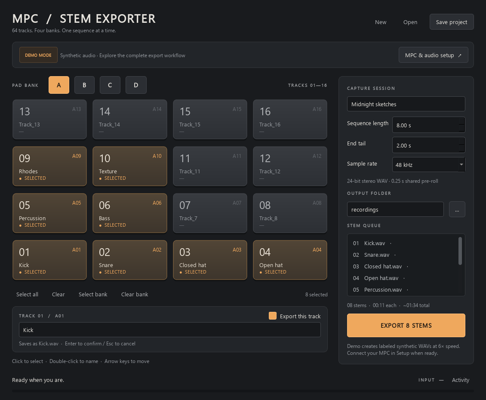
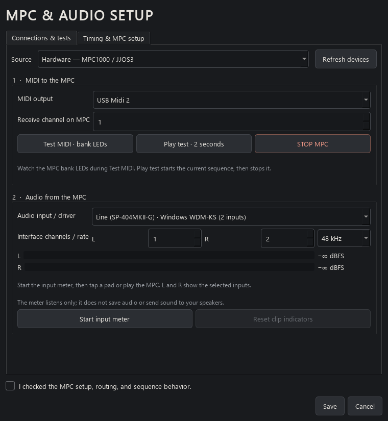
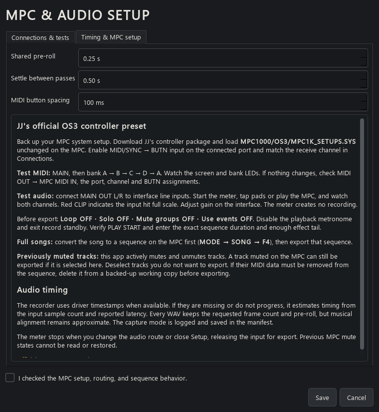

# MPC Stem Exporter

A working Windows desktop prototype for selecting, naming and recording MPC1000
JJOS3 tracks through a 16-pad interface. Four banks share one persistent 64-track
model. The MIDI controller, audio recorder, exporter and UI are separate modules.



## Features

- Four banks of 16 pads with persistent selection and names across all 64 tracks.
- Sequential stereo 24-bit WAV capture with fixed lengths and preserved leading silence.
- Direct MIDI control for MPC1000 / JJOS3, with bank and transport routing tests.
- Live left/right input meters with clipping indicators before export.
- Project save/load, safe filenames, cancellation, and export progress manifests.
- Hardware-free Demo mode for exploring the workflow.

## Screenshots

**Connections and routing tests** — test MIDI delivery and check incoming stereo audio.



**MPC preparation** — controller preset, full-song conversion, muted-track guidance and timing details.



Screenshots show the application's Qt interface with example device selections;
the meter is stopped and does not imply a verified physical audio connection.

## Current version

Version **0.1.3** includes full-song preparation and previously muted track
guidance in Setup. For a full song, convert it to a sequence on the MPC first
(**MODE → SONG → F4**), then export that sequence. This app actively mutes/unmutes
tracks: an existing MPC mute does not exclude a selected track from export.
Deselect unwanted tracks in the app. If you need to delete their MIDI data,
do so in a backed-up working copy of the sequence.

Version **0.1.2** adds MIDI routing tests and a live stereo input meter in Setup.
Drivers without usable capture timestamps now record with approximate timing
instead of aborting. Each hardware pass reports the timing method in its manifest.

Version **0.1.1** fixed exports stopping when Windows temporarily prevents the
`export.json` progress file from being replaced. The app retries brief locks;
if a lock persists, it continues recording and writes independent progress
snapshots instead. Activity reports their location. The latest snapshot is the
one with the highest `manifest_revision`. A progress-file lock never requires
administrator rights or changes to Windows security settings.

## Start

This repository contains the source. To run it on Windows, install Python 3.11
or newer and Git, then:

```powershell
git clone https://github.com/diamond-one/MPC1000-Stem_exporter.git
cd MPC1000-Stem_exporter
python -m venv .venv
.\.venv\Scripts\python.exe -m pip install -e .
.\.venv\Scripts\python.exe -m mpc_stem_exporter
```

To create a standalone executable, follow [Build the portable Windows app](#build-the-portable-windows-app).
Prebuilt executables and recordings are not stored in Git.

If you have the separately packaged portable Windows build, extract **MPC-Stem-Exporter-Windows.zip** in full
and open **MPC Stem Exporter.exe**. Keep `_internal` beside the executable. It
requires no separate Python installation. This is a locally built, unsigned
prototype; no installer, administrator access or background service is used.

The first launch opens **Demo mode** with eight example tracks. Click pads to
select them; double-click or press F2 to rename. Export creates actual stereo
24-bit WAV files using synthetic tones, in a clearly labeled `DEMO_…` folder.
Demo uses no MIDI output and does not record your microphone or interface.

## Use with the MPC

Open **MPC & audio setup**, choose Hardware, select MIDI output, audio input,
physical left/right channels and matching MIDI receive channel. Follow the setup
instructions there. The required mappings, official setup-file link and exact
track isolation sequence are in [the research and specification](docs/RESEARCH-AND-SPEC.md).

JJ's OS3 setup file is **not bundled**. Back up your MPC system setup before
loading it. Disable sequence looping, solo, mute groups, stored mute-event playback
and the playback metronome. Verify PLAY START and the sequence's actual duration.
Keep any JJ controller or other application that uses the same MIDI/audio ports
closed while exporting.

### Test routing before exporting

In **MPC & audio setup → Connections & tests**, choose **Hardware**:

- **Test MIDI · bank LEDs** sends MAIN and cycles A → B → C → D → A. Watch the
  MPC screen and bank LEDs. A successful send confirms the computer sent MIDI;
  only the MPC responding confirms the complete route. This test does not change
  track mutes. If it does not respond, check the MIDI cable, output, receive
  channel, BUTN input and official OS3 button assignments.
- **Play test · 2 seconds** sends PLAY START, waits about two seconds and sends
  STOP. **STOP MPC** also stops a running test. Closing Setup stops an active test.
- Choose the audio input/driver, physical L/R channels and sample rate, then
  **Start input meter**. Tap a pad or play the MPC. Separate L/R bars show input
  levels, with a latched **CLIP** indicator if an input reaches full scale.
  Adjust input gain on the interface and use **Reset clip indicators** to retest.
  The meter creates no recording and sends no audio to speakers. Changing the
  input route or closing Setup releases the audio device for export.

If no signal appears, check MPC MAIN OUT → interface line inputs, interface gain
and routing, and the selected channel pair. The same interface may appear under
several Windows drivers; select the one that successfully opens and receives
audio. MIDI and audio can be tested separately, or run the meter during Play test.

1. Select pads across any bank. Selections stay in place.
2. Name tracks if desired. Blank names use their global track number, such as
   `Track_36.wav` for Bank C pad 4.
3. Enter sequence duration and end tail, select sample rate and output folder.
4. Press **EXPORT N STEMS**. The app records one selected track at a time, in
   global order. Bank browsing remains available while editing is locked.
5. Use **Open exported stems** when finished. Every run gets its own folder with
   WAV files and `export.json`, including completed/failed passes and capture data.
   If Windows holds `export.json` open, use the `export-recovery-…json` file
   identified in Activity for the latest state. Completed WAVs remain normal WAVs.

All WAVs have identical frame counts and preserve intentional leading silence.
They also retain a fixed shared pre-roll (250 ms by default). **MIDI timing is
approximate; sample-exact musical alignment has not been verified on an MPC.**
The app uses audio timestamps to reference each pass to the MIDI PLAY START send
when available. Otherwise it estimates timing from captured sample counts,
callback arrival and reported input latency, retaining a fixed output length.
See the specification for the stronger reference-signal approach needed before
making a production sample-accuracy guarantee.

**Stop export** cancels the current pass, attempts MPC STOP, and keeps finished
files. An error stops the queue. A fresh export never overwrites previous stems.
If a MIDI cable is disconnected, press STOP on the MPC itself. The app cannot read
the MPC's previous mute state; it leaves the last isolation in place. F2 CLEAR on
the Track Mute page unmutes all tracks.

## Projects and keyboard

Names, selection, timing, device settings and statuses autosave beside the app
in `user-data/last-project.json`. Save/Open also use portable `.json` projects.
New starts an empty 64-track session and backs up the previous session first.
Interrupted queued/recording statuses reset on reopen; completed statuses remain.

| Action | Interaction |
| --- | --- |
| Include/exclude a track | Click pad or press Space on focused pad |
| Name a track | Double-click, F2, or use the name field below the grid |
| Confirm/cancel a name | Enter / Escape |
| Navigate pads | Arrow keys; Tab to move between other controls |
| Select/Clear all 64 | Select all / Clear |
| Select/Clear visible 16 | Select bank / Clear bank |
| Save/Open project | Ctrl+S / Ctrl+O |

The **Activity** view shows MIDI operations and errors. Peaks shown during capture
are sample peaks; clipping is also recorded in the manifest. Gain is set on the
audio interface, with no automatic normalization. Setup provides input metering
before export. The Windows audio APIs available depend on your driver;
device and host-API selection are explicit and saved by name. Missing or stagnant
timestamps use approximate sample-clock timing, logged in Activity and the manifest.
An audio overflow or device disconnection still stops the pass.
Very long passes that exceed the prototype's 4 GB WAV capture limit are rejected.

## Validation and scope

Run the automated checks with:

```powershell
.\.venv\Scripts\python.exe -m pip install -e '.[test]'
.\.venv\Scripts\python.exe -m pytest -q
```

Tests cover all 64 MIDI mappings, state persistence, filenames, cancellation,
failures, WAV properties and native Qt interactions. A successful demo export
does not establish hardware compatibility or accurate timing. **No physical
MPC1000 was tested during this build.** The hardware acceptance procedure is
included in the specification.

Prototype limits: no MPC state readback, no automatic duration/tempo discovery,
no previous mute-mask restoration, no reference-signal alignment, and no
multi-sequence automation. JJ Controller, Bome and a DAW are not dependencies.

## Build the portable Windows app

```powershell
.\.venv\Scripts\python.exe -m pip install pyinstaller
.\.venv\Scripts\python.exe build_windows.py
```

The executable is created at `dist/MPC Stem Exporter/MPC Stem Exporter.exe`.
Distribute the complete directory, including `_internal`. Use the supplied build
script so unrelated DLLs on the system PATH are excluded from the package.

The application is unassociated with Akai or JJ. It includes no third-party
branding, setup binary or controller executable. Python, Qt for Python/PySide6,
NumPy, Mido, RtMidi, PortAudio and libsndfile retain their respective licenses.
